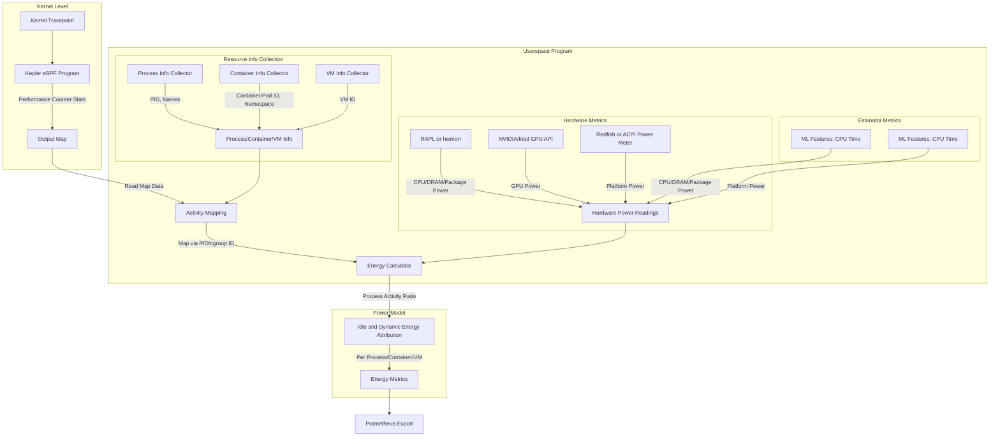

<!-- markdownlint-disable  MD013 -->
<!-- Teporarily disable MD013 - Line length for the urls below  -->

<!-- markdownlint-enable  MD013 -->

<!--

-->

[![License][apache2-badge]][apache2-url] [![License][bsd2-badge]][bsd2-url]
[![License][gpl-badge]][gpl-url]

# Kepler

Kepler (Kubernetes Efficient Power Level Exporter) uses eBPF to probe
energy-related system stats and exports them as Prometheus metrics.

As a CNCF Sandbox project, Kepler uses
[CNCF Code of Conduct](https://github.com/cncf/foundation/blob/main/code-of-conduct.md)

## Architecture

Kepler Exporter exposes a variety of
[metrics](https://sustainable-computing.io/design/metrics/) about the energy
consumption of Kubernetes components such as Pods and Nodes.

## Install Kepler

Instructions to install Kepler can be found in the
[Kepler docs](https://sustainable-computing.io/installation/kepler/).

## Visualise Kepler metrics with Grafana

To visualise the power consumption metrics made available by the Kepler
Exporter, import the pre-generated
[Kepler Dashboard](grafana-dashboards/Kepler-Exporter.json) into Grafana:

## Contribute to Kepler

Interested in contributing to Kepler? Follow the
[Contributing Guide](CONTRIBUTING.md) to get started!

## Talks & Demos

- [Kepler Demo](https://www.youtube.com/watch?v=P5weULiBl60)
- ["Sustainability the Container Native Way" - Open Source Summit NA 2022](doc/OSS-NA22.pdf)

A full list of talks and demos about Kepler can be found
[here](https://github.com/sustainable-computing-io/kepler-doc/tree/main/demos).

## Community Meetings

Please join the biweekly community meetings. The meeting calendar and agenda can
be found
[here](https://github.com/sustainable-computing-io/community/blob/main/community-event.md)

## License

With the exception of eBPF code, everything is distributed under the terms of
the [Apache License (version 2.0)].

### eBPF

All eBPF code is distributed under either:

- The terms of the [GNU General Public License, Version 2] or the
  [BSD 2 Clause license], at your option.
- The terms of the [GNU General Public License, Version 2].

The exact license text varies by file. Please see the SPDX-License-Identifier
header in each file for details.

Files that originate from the authors of kepler use (GPL-2.0-only OR
BSD-2-Clause). Files generated from the Linux kernel i.e vmlinux.h use
GPL-2.0-only.

Unless you explicitly state otherwise, any contribution intentionally submitted
for inclusion in this project by you, as defined in the GPL-2 license, shall be
dual licensed as above, without any additional terms or conditions.

[apache license (version 2.0)]: LICENSE-APACHE
[apache2-badge]: https://img.shields.io/badge/License-Apache%202.0-blue.svg
[apache2-url]: https://opensource.org/licenses/Apache-2.0
[bsd 2 clause license]: LICENSE-BSD-2
[bsd2-badge]: https://img.shields.io/badge/License-BSD%202--Clause-orange.svg
[bsd2-url]: https://opensource.org/licenses/BSD-2-Clause
[gnu general public license, version 2]: LICENSE-GPL-2
[gpl-badge]: https://img.shields.io/badge/License-GPL%20v2-blue.svg
[gpl-url]: https://opensource.org/licenses/GPL-2.0

## Star History

